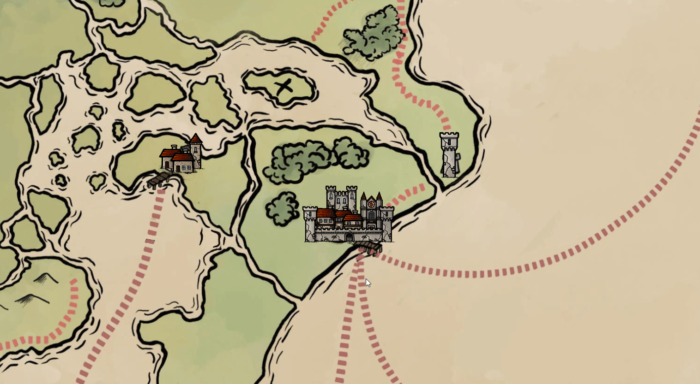

# FVTT-Backgroundless-Pins

Removes the background box from map notes.

This preview also uses the Pin Cushion module to allow for customizable map note icons.

## Acknowledgements

- Thank you to [/u/DungeonMasterGroon](https://www.reddit.com/user/DungeonMasterGroon) for the [Eyrebrin Map](https://www.reddit.com/r/dndmaps/comments/ersprs/my_homebrew_continent_of_eyrebrin/) used in the preview.
- Thank you to Caeora for the [Map Icons 2.0 Pack](https://www.caeora.com/product-page/map-icons-2-0).
- Thank you to errational#2007 for the [Pin Cushion module](https://foundryvtt.com/packages/pin-cushion/) (not required for this module, but they synergize well).

## License

Licensed under the GPLv3 License (see [LICENSE](LICENSE)).
