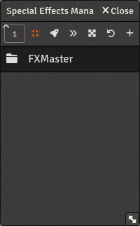
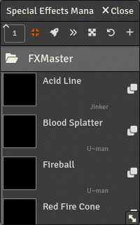
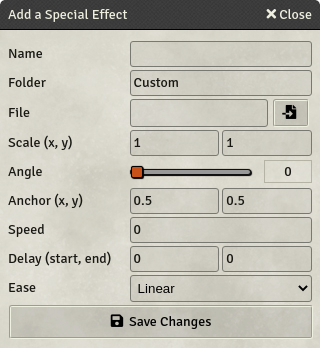
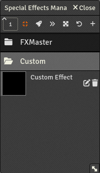
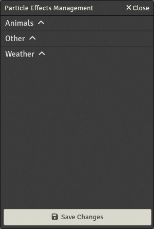
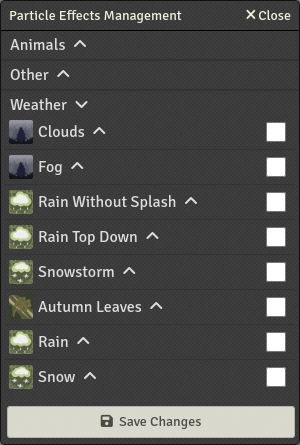
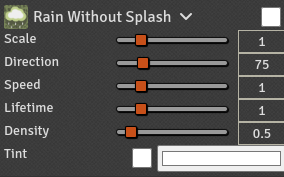
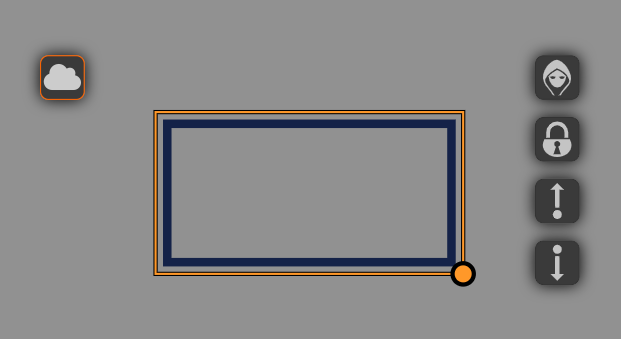
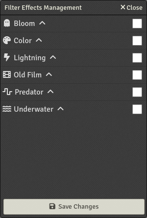

# FXMaster

[](https://github.com/ghost-fvtt/fxmaster/actions)


[](https://forge-vtt.com/bazaar#fxmaster)
[](https://www.foundryvtt-hub.com/package/fxmaster/)
[](https://ko-fi.com/ghostfvtt)

FXMaster is a module for [Foundry Virtual Tabletop] that provides various types of effects:

- _Particle Effects_, including weather (rain, clouds, fog, snow, etc.), animals (crows, bats, spiders, etc.), and a few
  others.
- _Filter Effects_, including color overlays, underwater, and lightning.
- Clickable _Special Effects_, using video files provided by external sources.

This module also provides ways to easily configure these effects.

## Table of Contents

- [FXMaster](#fxmaster)
  - [Table of Contents](#table-of-contents)
  - [Installation Instructions](#installation-instructions)
  - [FAQ](#faq)
  - [Usage](#usage)
    - [Special Effects ](#special-effects-)
      - [Playing Special Effects](#playing-special-effects)
      - [Elevation](#elevation)
      - [Cast Modes](#cast-modes)
      - [Managing Custom Special Effects](#managing-custom-special-effects)
    - [Particle Effects ](#particle-effects-)
      - [Masking Particle Effects](#masking-particle-effects)
      - [⚠ Warning Regarding Large Scenes](#-warning-regarding-large-scenes)
    - [Invert Particle Effect Mask ](#invert-particle-effect-mask-)
    - [Filter Effects ](#filter-effects-)
    - [Save Particle and Filter Effects as Macro ](#save-particle-and-filter-effects-as-macro-)
    - [Clear Particle and Filter Effects ](#clear-particle-and-filter-effects-)
  - [Developer API](#developer-api)
    - [Filter Effects](#filter-effects)
      - [Available Filter Effects With Supported Options](#available-filter-effects-with-supported-options)
    - [Particle Effects](#particle-effects)
      - [Available Particle Effects With Supported Options](#available-particle-effects-with-supported-options)
      - [Particle Effect Options](#particle-effect-options)
    - [Special Effects](#special-effects)
      - [Playing a Video File on the Canvas](#playing-a-video-file-on-the-canvas)
      - [Retrieving Effect Presets](#retrieving-effect-presets)
      - [Playing a Video File Between Two Tokens](#playing-a-video-file-between-two-tokens)
      - [Animation Easing](#animation-easing)
    - [Adding Your Own Special Effects to FXMaster](#adding-your-own-special-effects-to-fxmaster)
  - [Contributing](#contributing)
  - [Acknowledgement](#acknowledgement)
  - [Licensing](#licensing)

## Installation Instructions

To install FXMaster, find FXMaster in the module browser, or paste the following URL into the Install Module dialog in
the Setup menu of Foundry Virtual Tabletop:

```
https://github.com/ghost-fvtt/fxmaster/releases/latest/download/module.json
```

## FAQ

- Q: I have put a special effect onto a scene, and now I can't get rid of it anymore. How do I remove it?

  A: Most likely, your created a permanently playing special effect by dragging a special effect onto the canvas, which
  is just a regular [Tile](https://foundryvtt.com/article/tiles/) and not managed by FXMaster. To remove it, go to the
  Tile Controls and remove the Tile there.

- Q: What is the difference between Particle Effects, Filter Effects, and Special Effects?

  A: Particle Effects are global effects that display particles on the whole scene. Mostly they are weather effects, but
  they also include animals and some other effects.<br>
  Filter Effects are filters that adjust the whole scene in some way, e.g. by adjusting the color or distorting the
  scene to look like it's underwater.<br>
  Special Effects are animations (video files) that can be played on your chosen location on the canvas.

- Q: Can I provide my own effects?

  A: You can provide your own Special Effects, as described in [Managing Custom Special Effects](#managing-custom-special-effects).
  It's not possible to provide your own Particle Effects or Filter Effects at this point.

- Q: I have installed a module that provides additional animation files, but they are not showing up as Special Effects.
  What do I need to do?

  A: Some of these modules (e.g. [JB2A]) provide a setting to activate their integration with FXMaster, which is
  disabled by default. You can enable that setting in the module settings. If there is no such setting, the module may
  not provide direct integration with FXMaster. In that case, you can still use the animation files provided by the
  module, but you need to configure them by yourself as described in [Managing Custom Special Effects](#managing-custom-special-effects).

## Usage

The functionality of FXMaster can be accessed via the _Effect Controls_
() in the scene controls. Each
individual functionality of FXMaster has its own tool inside this scene control.

### Special Effects 

_Special Effects_ are essentially video files that can be played on the canvas via clicking or dragging. FXMaster
includes only a couple of example effects. If you want more, you will need to install a module providing animation files
like [JB2A], [Jinker's Animated Art], or [Jack Kerouac's Animated Spell Effects]. All of them integrate with FXMaster.
Alternatively, you can also [add your own _Special Effects_](#managing-custom-special-effects).

Clicking on this tool opens the _Special Effects Management_ dialog:



In this dialog, you can see folders containing different sets of _Special Effects_. By clicking on a folder, you expand
it:



You can preview the effects by hovering over the black box with your mouse.

Predefined _Special Effects_ have a clone icon
() on the right. By clicking it,
you open a dialog to create a custom _Special Effect_, prefilled with the data from this _Special Effect_. For more
information on creating custom _Special Effects_, see
[Managing Custom Special Effects](#managing-custom-special-effects).

#### Playing Special Effects

In order to play a special effect, simply select it from the list and click on the canvas while having the _Effects
Controls_ active (it doesn't work if you have any other control such as the Token Controls active). Alternatively, you
can drag on the canvas, which shows a red line from the start point to your mouse pointer. Releasing the mouse button
then results in the effect being played, facing the direction you dragged towards. Depending on the selected
[_Cast Mode_](#cast-modes), the _Special Effect_ might also move or scale towards that direction.

You can also create permanently playing variants of _Special Effects_. In order to do so, simply drag the
_Special Effect_ from the _Special Effects Management_ onto the scene. This creates a [Tile](https://foundryvtt.com/article/tiles/)
with the video of the _Special Effect_. The Tile is not managed by FXMaster, it is just a regular Foundry Core Tile. In
particular, this means that, in order to move, resize, or adjust it in any other way, or also to remove it, you need to
go to the Tile Controls and perform the desired action there.

#### Elevation

The elevation input field in the top row of the _Special Effects Management_ allows you to specify at which elevation
_Special Effects_ are being played. The default elevation is 1, which is just above the default elevation of tokens,
tiles, and drawings (they sit at 0, by default).

#### Cast Modes

The first five icons in the top row of the _Special Effects Management_ provide a way to switch between the different
_Cast Modes_ for _Special Effects_, simply by clicking on them. Here is an overview of the available modes:

| _Cast Mode_      |                                            Icon                                             | Description                                                                                                             |
| ---------------- | :-----------------------------------------------------------------------------------------: | ----------------------------------------------------------------------------------------------------------------------- |
| Face Target      |           | _Special Effects_ face towards the target.                                                                              |
| Move to Target   |          | _Special Effects_ face and move towards the target.                                                                     |
| Extend to Target |  | _Special Effects_ face towards the target and extend to it.                                                             |
| Expand to Target |      | _Special Effects_ face towards the target and expand to it, scaling the whole effect up while keeping the aspect ratio. |
| Rotate           |       | _Special Effects_ rotate clockwise. The dragged distance specifies the rotation speed.                                  |

#### Managing Custom Special Effects

Custom _Special Effects_ can be added in two ways: By cloning a predefined one as explained above, or by clicking the
plus icon () in the top row of the
_Special Effects Management_. In both cases, a dialog to create a new custom _Special Effect_ is opened:



In this dialog, you can choose the name of the _Special Effect_, specify the folder it should be created in (you can
also specify a new folder name), select the video file to use, and configure the various options. Once you are done, hit
the “Save Changes” button to save the _Special Effect_ and close the dialog.



Instead of the clone icon that predefined _Special Effects_ have, custom ones have edit
() and delete
() icons. Clicking the edit
icon opens the dialog to create a custom _Special Effect_, prefilled with the data from this one. You can overwrite the
existing one by keeping the name and folder the same. Clicking the delete icon simply deletes the _Special Effect_.

### Particle Effects 

_Particle Effects_ are global effects that are displayed all across the scene. They include weather effects like rain,
fog, clouds, and snow, but also other global particle effects such as birds flying across the scene or spiders crawling
around.

Clicking on this tool opens the _Particle Effects Management_ dialog:



In this dialog, you can configure individual _Particle Effects_. They are sorted into different groups (“Animals”,
“Other”, and “Weather”). By clicking on a group, you expand it, showing all effects in that group:



You can activate individual _Particle Effects_ by checking the corresponding checkbox and then clicking on “Save Changes”.

By clicking on the name of a _Particle Effect_, you expand it, showing the options for that effect:



The available options differ slightly between _Particle Effects_ because not all options make sense for all of them. The
options are:

| Option     | Description                                                                                                                 |
| ---------- | --------------------------------------------------------------------------------------------------------------------------- |
| Scale      | A factor that scales the effect relative to its base size.                                                                  |
| Direction  | The direction of the effect in degrees.                                                                                     |
| Speed      | A factor that adjusts the speed of the effect relative to its base speed.                                                   |
| Lifetime   | A factor that adjusts the lifetime of the individual particles.                                                             |
| Density    | The density of the effect. For most effects, it represents the number of particles per grid unit.                           |
| Opacity    | A factor between 0 and 1 that adjusts the opacity of the particles.                                                         |
| Tint       | Tint the effect with this color.                                                                                            |
| Animations | A selection of animations from the list of animations for the effect to use. If it is empty, the default animation is used. |

Once you are finished with adjusting the options, you can apply them by clicking the “Save Changes” button.

#### Masking Particle Effects

By default, _Particle Effects_ are displayed all across the entire scene. However, it is possible to constrain them to
specific areas. This can be achieved by creating drawings and then marking them as _Particle Effect Mask_. To do that,
open the HUD for the drawing (by right-clicking the drawing) and then click on the “Mask FXMaster Particle Effects”
control icon ()
on the left of the drawing HUD:



You can mark as many drawings as mask as you want.

By default, the _Particle Effects_ are only displayed outside the marked areas. This can be inverted via the
[_Invert Particle Effect Mask_](#invert-particle-effect-mask-) tool.

#### ⚠ Warning Regarding Large Scenes

Similar to the foundry core weather effects, the _Particle Effects_ provided by FXMaster can have a pretty significant
impact on performance in large scenes (around 10,000 px × 10,000 px and larger). Be careful when enabling
_Particle Effects_ in such scenes as it might make them crash. If that happens, launch the world in safe configuration
and delete the configured _Particle Effects_ for the scene by running the following as a script macro or in the
developer console (F12):

```js
canvas.scene.unsetFlag("fxmaster", "effects");
```

You can then safely reactivate your modules.

### Invert Particle Effect Mask 

Clicking on this tool inverts the _Particle Effect Mask_ for the current scene. This tool acts as a toggle and the color
indicates whether it is currently active or not.

Inverting the _Particle Effect Mask_ can be very useful when the goal is to display _Particle Effects_ only in specific
smaller areas, instead of specifying the areas in which they should not be displayed, which is the default.

### Filter Effects 

_Filter Effects_ work similarly to _Particle Effects_. They are also displayed all across the entire scene but unlike
_Particle Effects_ it's _not_ possible to confine them to certain areas with a mask.

Clicking on this tool open the _Filter Effects Management_ dialog:



You can activate individual _Filter Effects_ by checking the corresponding checkbox and then clicking on “Save Changes”.

By clicking on the name of a _Filter Effect_, you expand it, showing the options for that effect:


The available options differ heavily between individual _Filter Effects_, so it doesn't make much sense to list them
here.

Once you are finished with adjusting the options, you can apply them by clicking the “Save Changes” button.

### Save Particle and Filter Effects as Macro 

This tool allows you to create a macro from the currently active _Particle Effects_ and _Filter Effects_. When clicking
this tool, a macro is created in the macro directory. It's not put into the hotbar, so you need to drag it there
yourself if you want to.

When executed, the macro sets the _Particle Effects_ and _Filter Effects_ of the current scene to the state from when the
macro was created.

### Clear Particle and Filter Effects 

When clicked, this tool shows a confirmation dialog to delete all _Particle Effects_ and _Filter Effects_ from the
current scene.

## Developer API

FXMaster provides functionality to interact with _Filter Effects_, _Particle Effects_, and _Special Effects_ from other
packages and macros.

### Filter Effects

- Adding or updating a named filter
  ```javascript
  FXMASTER.filters.addFilter("myfilterID", "color", {
    color: { value: "#ff00ff", apply: true },
    gamma: 1.0,
    contrast: 1.0,
    brightness: 1.0,
    saturation: 0.2,
  });
  ```
- Removing a named filter
  ```javascript
  FXMASTER.filters.removeFilter("myfilterID");
  ```
- Toggling a named filter on and off
  ```javascript
  FXMASTER.filters.switch("myfilterID", "color", {
    color: { value: "#ff00ff", apply: true },
    gamma: 1.0,
    contrast: 1.0,
    brightness: 1.0,
    saturation: 0.2,
  });
  ```
- Setting the list of active filters
  ```javascript
  FXMASTER.filters.setFilters([
    {
      type: "color",
      options: {
        /* ... */
      },
    },
    {
      type: "lightning",
      options: {
        /* ... */
      },
    },
  ]);
  ```

#### Available Filter Effects With Supported Options

| Type         | Options                                                  |
| ------------ | -------------------------------------------------------- |
| `lightning`  | `frequency`, `spark_duration`, `brightness`              |
| `underwater` | `speed`, `scale`                                         |
| `predator`   | `noise`, `period`, `lineWidth`                           |
| `color`      | `color`, `saturation`, `contrast`, `brightness`, `gamma` |
| `bloom`      | `blur`, `bloomScale`, `threshold`                        |
| `oldfilm`    | `sepia`, `noise`                                         |

You can get a complete list by typing `CONFIG.fxmaster.filters` in your web console.

### Particle Effects

- Switching a named particle effect on and off:
  ```javascript
  Hooks.call("fxmaster.switchParticleEffect", {
    name: "myParticleEffectID",
    type: "rain",
    options: { density: 0.5 },
  });
  ```
- Setting the active paticle effects:
  ```javascript
  Hooks.call("fxmaster.updateParticleEffects", [
    {
      type: "rain",
      options: {
        /* ... */
      },
    },
    {
      type: "bubbles",
      options: {
        /* ... */
      },
    },
  ]);
  ```

#### Available Particle Effects With Supported Options

| Type         | `scale` | `direction` | `speed` | `lifetime` | `density` | `alpha` | `tint` |         `animations`         |
| ------------ | :-----: | :---------: | :-----: | :--------: | :-------: | :-----: | :----: | :--------------------------: |
| `snowstorm`  |    ✓    |      ✓      |    ✓    |     ✓      |     ✓     |    ✓    |   ✓    |                              |
| `bubbles`    |    ✓    |             |    ✓    |     ✓      |     ✓     |    ✓    |   ✓    |                              |
| `clouds`     |    ✓    |      ✓      |    ✓    |     ✓      |           |    ✓    |   ✓    |                              |
| `embers`     |    ✓    |             |    ✓    |     ✓      |     ✓     |    ✓    |   ✓    |                              |
| `rainsimple` |    ✓    |      ✓      |    ✓    |     ✓      |     ✓     |    ✓    |   ✓    |                              |
| `stars`      |    ✓    |             |    ✓    |     ✓      |     ✓     |    ✓    |   ✓    |                              |
| `crows`      |    ✓    |             |    ✓    |     ✓      |     ✓     |    ✓    |   ✓    |                              |
| `bats`       |    ✓    |             |    ✓    |     ✓      |     ✓     |    ✓    |   ✓    |                              |
| `spiders`    |    ✓    |             |    ✓    |     ✓      |     ✓     |    ✓    |   ✓    |                              |
| `fog`        |    ✓    |             |    ✓    |     ✓      |     ✓     |    ✓    |   ✓    |                              |
| `raintop`    |    ✓    |      ✓      |    ✓    |     ✓      |     ✓     |    ✓    |   ✓    |                              |
| `birds`      |    ✓    |             |    ✓    |     ✓      |     ✓     |    ✓    |   ✓    | ✓ (`glide`, `flap`, `mixed`) |
| `leaves`     |    ✓    |             |    ✓    |     ✓      |     ✓     |    ✓    |   ✓    |                              |
| `rain`       |    ✓    |      ✓      |    ✓    |     ✓      |     ✓     |    ✓    |   ✓    |                              |
| `snow`       |    ✓    |      ✓      |    ✓    |     ✓      |     ✓     |    ✓    |   ✓    |                              |
| `eagles`     |    ✓    |             |    ✓    |     ✓      |     ✓     |    ✓    |   ✓    |     ✓ (`glide`, `flap`)      |

#### Particle Effect Options

| Option       | Type                              | Description                                                                                                                         |
| ------------ | --------------------------------- | ----------------------------------------------------------------------------------------------------------------------------------- |
| `scale`      | `number`                          | A factor that scales the effect relative to its base size.                                                                          |
| `direction`  | `number`                          | The direction of the effect in degrees.                                                                                             |
| `speed`      | `number`                          | A factor that adjusts the speed of the effect relative to its base speed.                                                           |
| `lieftime`   | `number`                          | A factor that adjusts the lifetime of the individual particles.                                                                     |
| `density`    | `number`                          | The density of the effect. For most effects, it represents the number of particles per grid unit.                                   |
| `alpha`      | `number`                          | A factor between 0 and 1 that adjusts the opacity of the particles (this is called “Opacity” in the Particle Effects Management).   |
| `tint`       | `{value: string, apply: boolean}` | Tint the effect with this color.                                                                                                    |
| `animations` | `string[]`                        | An array of animations from list of animations for the effect to use. If it is empty or not defined, the default animation is used. |

### Special Effects

Special effects are essentially temporary video files that are being played on the canvas. They are defined by several
parameters:

| Parameter        | Type                           | Description                                                                                                                                                                             |
| ---------------- | ------------------------------ | --------------------------------------------------------------------------------------------------------------------------------------------------------------------------------------- |
| `file`           | `string`                       | The video file path.                                                                                                                                                                    |
| `anchor`         | `{x: number, y: number}`       | The starting point of the effect. `x` and `y` are values between `0` and `1.0`, representing fractions of the width and height of the video file.                                       |
| `position`       | `{x: number, y: number}`       | The position at which the anchor of the effect is to be placed.                                                                                                                         |
| `angle`          | `number`                       | The initial direction of the effect in degrees. The default assumption is that the effect direction from left to right. If that's not the case, you need to set this value accordingly. |
| `speed`          | `number \| "auto"`             | The speed at which the effect plays and moves.                                                                                                                                          |
| `scale`          | `{x: number, y: number}`       | The scale of the effect. `x` and `y` are numbers between `0` and `1`, representing by how much the width and height of the effect are scaled.                                           |
| `animationDelay` | `{start: number, end: number}` | Delays before and after the effect plays (if `speed > 0`).                                                                                                                              |
| `ease`           | `string`                       | The easing function to use in order for the movement animation to look more natural. You can find the valid values in `easeFunctions` in [ease.js](./src/ease.js).                      |
| `width`          | `number`                       | Sets the width of the sprite. For example, this can be used to stretch a beam towards a specific target.                                                                                |
| `elevation`      | `number`                       | Sets the elevation at which the effect is played.                                                                                                                                       |

#### Playing a Video File on the Canvas

```javascript
const data = {
  file: "myfile.webm",
  position: {
    x: 1200,
    y: 1200,
  },
  anchor: {
    x: 0,
    y: 1,
  },
  angle: 90,
  speed: 0,
  scale: {
    x: 0.7,
    y: 0.7,
  },
};
canvas.specials.playVideo(data);
game.socket.emit("module.fxmaster", data);
```

#### Retrieving Effect Presets

From module presets

```js
const effectData = CONFIG.fxmaster.specialEffects.fxmaster.effects.find((ef) => ef.label === "Blood Splatter");
```

From custom presets

```js
const effectData = CONFIG.fxmaster.specialEffects.custom.effects.find((ef) => ef.label === "Energy Circle");
```

#### Playing a Video File Between Two Tokens

You can use the `canvas.specials.drawSpecialToward` method with the speed set to `"auto"` to adapt the speed so that the
video ends when the target is reached.

```javascript
function castSpell(effect) {
  const tokens = canvas.tokens.controlled;
  if (tokens.length == 0) {
    ui.notifications.error("Please select a token");
    return;
  }
  game.user.targets.forEach((i, t) => {
    canvas.specials.drawSpecialToward(effect, tokens[0], t);
  });
}

castSpell({
  file: "modules/fxmaster/assets/specialEffects/jinker/dragonBornBlack-CopperAcid30x5Line.webm",
  anchor: {
    x: -0.08,
    y: 0.5,
  },
  speed: "auto",
  angle: 0,
  scale: {
    x: 1,
    y: 1,
  },
});
```

#### Animation Easing

You can customize the `canvas.specials.drawSpecialToward` to ease the animation toward the target. Here is some example
data. The easing options are given in the `ease.js` file.

```javascript
{
  file: "modules/fxmaster/assets/specialEffects/jinker/dragonBornBlack-CopperAcid30x5Line.webm",
    anchor: {
      x: -.08,
      y: 0.5
    },
  speed: "auto",
  angle: 0,
  scale: {
    x: 1,
    y: 1
  }
  animationDelay: {
    start: 0.5,
    end: 0.2
  },
  ease: "InCirc"
}
```

### Adding Your Own Special Effects to FXMaster

Here is a demo module you can use as a template: [FoundryVTT FXMaster Specials Demo Template].

In one file, you configure each of your special effects:

```javascript
export const effects = {
  label: "MYMODULE",
  effects: [
    {
      label: "Smoke Bomb",
      file: "modules/fxmaster/assets/specialEffects/fxmaster/smokeBomb.webm",
      scale: {
        x: 1.0,
        y: 1.0,
      },
      angle: 0,
      anchor: {
        x: 0.5,
        y: 0.5,
      },
      speed: 0,
      author: "U~man",
    },
  ],
};
```

Then, in a second file, you add the previously created effects by merging them into the `CONFIG.fxmaster.specialEffects`
object as follows:

```javascript
import { effects } from "./effects.js";

Hooks.once("init", function () {
  // Adding special effects
  if (!CONFIG.fxmaster) CONFIG.fxmaster = {};
  foundry.utils.mergeObject(CONFIG.fxmaster, { specialEffects: { MYMODULE: effects } });
});
```

The effects should now appear in the Specials selection dialog.

## Contributing

Code and content contributions are accepted. Please feel free to submit issues to the issue tracker or submit pull
requests for code changes.

## Acknowledgement

Many thanks to:

- [U~man] for the original work on this module. Really, most of this is his work.
- [theripper93] for contributing his ideas regarding handling particle effect masking elegantly.
- [Wasp] for providing the [Sequencer] module that will inspire future updates.
- [SecretFire] for exchanging ideas, providing help, and shaders for the filter effects. Donate
  [here](https://ko-fi.com/secretfire).

## Licensing

- The software component of FXMaster is licensed under [BSD 3-Clause].
- Jinker's Acid Line and Red Fire Cone video effects are borrowed from [Jinker's Animated Art] and are licensed as free
  for use.
- Jules and Ben's Witch Bolt effect is from [JB2A] and is licensed under [CC BY-NC-SA-4.0].
- The Seagull sprites used in the Birds particle effect are from [whtdragon].
- The control and tool icons are from [Font Awesome], licensed under the [CC BY-4.0].
- The icons for particle effects are by Rexard and licensed under [Rexard Game Dev Assets EULA].
- The rat sprites used in the Rats particle effect by crymoonster are licensed under [CC BY-4.0].

[Foundry Virtual Tabletop]: https://foundryvtt.com/
[JB2A]: https://github.com/Jules-Bens-Aa/JB2A_DnD5e
[Jinker's Animated Art]: https://github.com/jinkergm/JAA
[Jack Kerouac's Animated Spell Effects]: https://github.com/jackkerouac/animated-spell-effects
[Sequencer]: https://github.com/fantasycalendar/FoundryVTT-Sequencer
[FoundryVTT FXMaster Specials Demo Template]: https://gitlab.com/mesfoliesludiques/foundryvtt-fxmaster-specials-template
[U~man]: https://github.com/mesfoliesludiques
[theripper93]: https://github.com/theripper93
[Wasp]: https://github.com/fantasycalendar
[SecretFire]: https://github.com/Feu-Secret
[whtdragon]: https://forums.rpgmakerweb.com/index.php?threads/whtdragons-animals-and-running-horses-now-with-more-dragons.53552/
[Font Awesome]: https://fontawesome.com/
[BSD 3-Clause]: ./LICENSES/BSD-3-Clause.txt
[CC BY-NC-SA-4.0]: ./LICENSES/CC-BY-NC-SA-4.0.txt
[CC BY-4.0]: ./LICENSES/CC-BY-4.0.txt
[Rexard Game Dev Assets EULA]: ./LICENSES/LicenseRef-RexardGameDevAssetsEULA.txt
